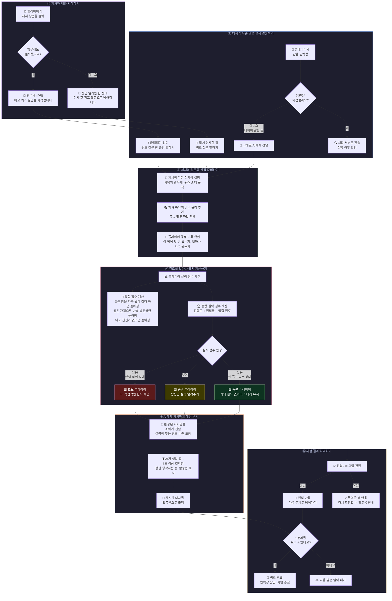
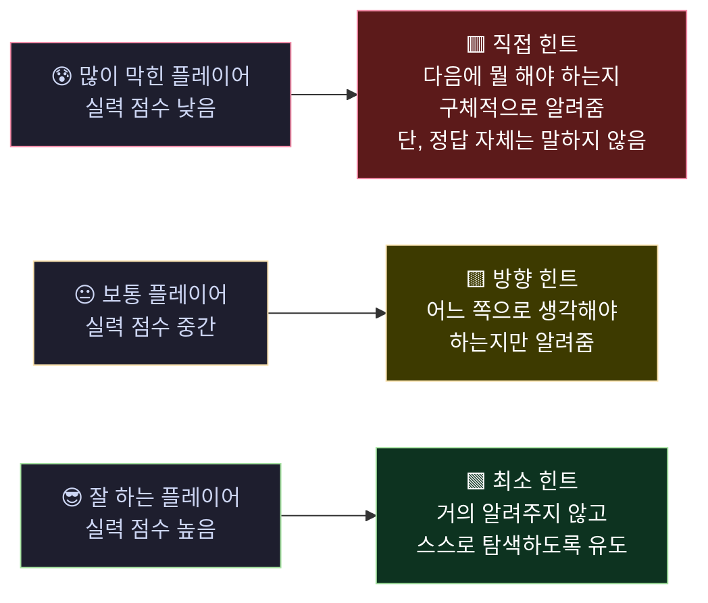
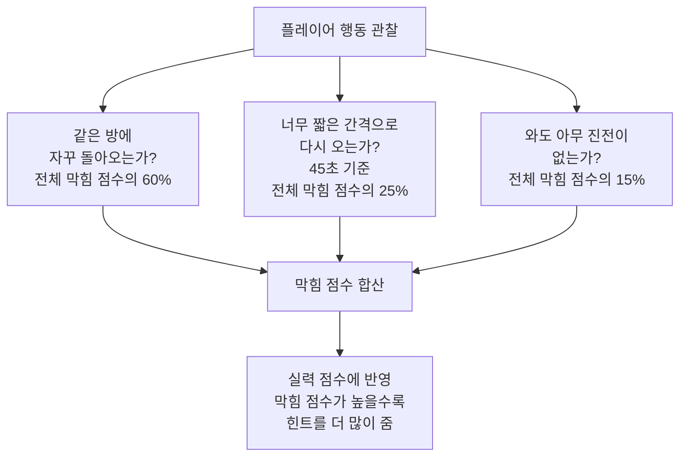

# 체셔는 어떻게 작동하나요?

체셔는 게임 속 저택에 사는 **앵무새 NPC**입니다.
플레이어가 퀴즈를 풀 때 힌트를 주는 역할을 하며,
플레이어가 얼마나 잘하고 있는지를 스스로 판단해서 **힌트의 양을 자동으로 조절**합니다.

---

## 전체 흐름 한눈에 보기

---

## 체셔가 힌트를 어떻게 조절하나요?

체셔는 플레이어를 **계속 지켜보면서** 세 가지를 측정합니다.

| 측정 항목 | 의미 |
|----------|------|
| **진행도** | 지금까지 퀴즈를 얼마나 풀었는가 |
| **정답률** | 맞힌 문제가 얼마나 많은가 |
| **막힘 정도** | 같은 방을 자꾸 들락날락하거나 오랫동안 진전이 없는가 |

이 세 가지를 종합해서 **실력 점수**를 계산하고, 점수에 따라 다음처럼 힌트를 다르게 줍니다.

---

## 힌트 수준 비교

---

## 막힘 점수는 어떻게 올라가나요?

---

## 체셔와 대화하는 순서 요약

> 1. **창문 클릭** → 체셔 창이 열림
> 2. **앵무새 클릭** → 퀴즈 시작 (이 순서를 지켜야 함)
> 3. **체셔가 질문** → 플레이어 실력에 맞는 힌트 수준으로 출제
> 4. **플레이어가 답변 입력** → 채점 서버에서 정답 여부 판단
> 5. **체셔가 반응** → 정답이면 다음 문제, 오답이면 다시 도전
> 6. **5문제 완료** → 퀴즈 종료
