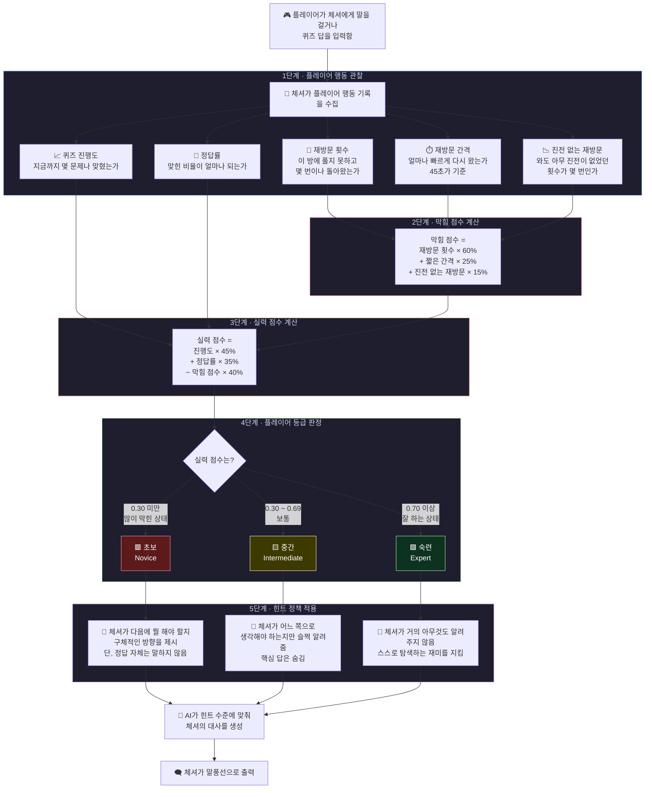

# 체셔의 힌트 조절 로직

체셔는 플레이어가 얼마나 막혀 있는지를 자동으로 파악해서 힌트의 양을 조절합니다.
정답을 직접 알려주지 않으면서도, 너무 어렵게 느끼지 않도록 균형을 맞추는 것이 목표입니다.

---

## 힌트 결정 전체 흐름

---

## 막힘 점수가 오르는 상황

| 상황 | 가중치 | 예시 |
|------|--------|------|
| 풀지 못하고 같은 방에 자꾸 돌아옴 | **60%** | 3번 이상 돌아오면 최대치 |
| 너무 짧은 간격으로 재방문 | **25%** | 45초 안에 돌아오면 높게 반영 |
| 와도 아무 진전이 없음 | **15%** | 3번 이상 반복되면 최대치 |

> 막힘 점수가 높을수록 실력 점수가 낮아지고, 체셔가 더 직접적인 힌트를 줍니다.

---

## 등급별 체셔 말투 차이

| 등급 | 실력 점수 | 체셔가 하는 말 방식 |
|------|----------|-------------------|
| 🟥 **초보** | 0.30 미만 | "이 물건을 한번 살펴봐" 처럼 다음 행동을 직접 제시 |
| 🟨 **중간** | 0.30 ~ 0.69 | "뭔가 연결되는 게 있지 않을까?" 처럼 방향만 암시 |
| 🟩 **숙련** | 0.70 이상 | "흥미롭구나…" 처럼 수수께끼 분위기 유지, 정보 최소화 |
