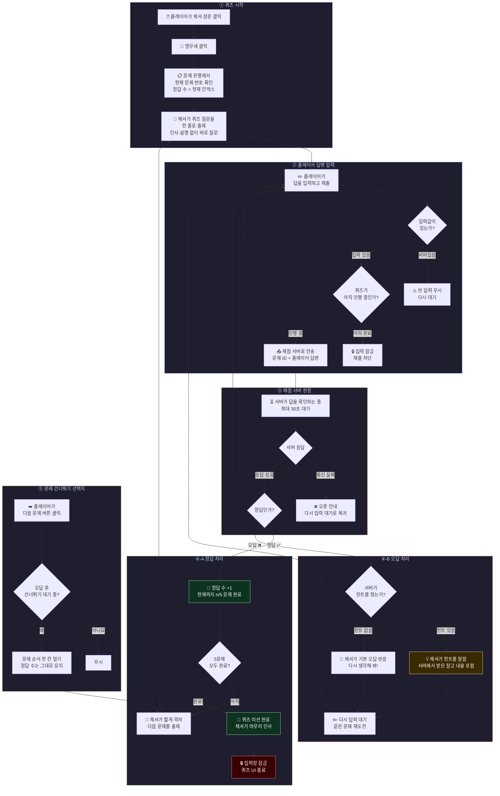
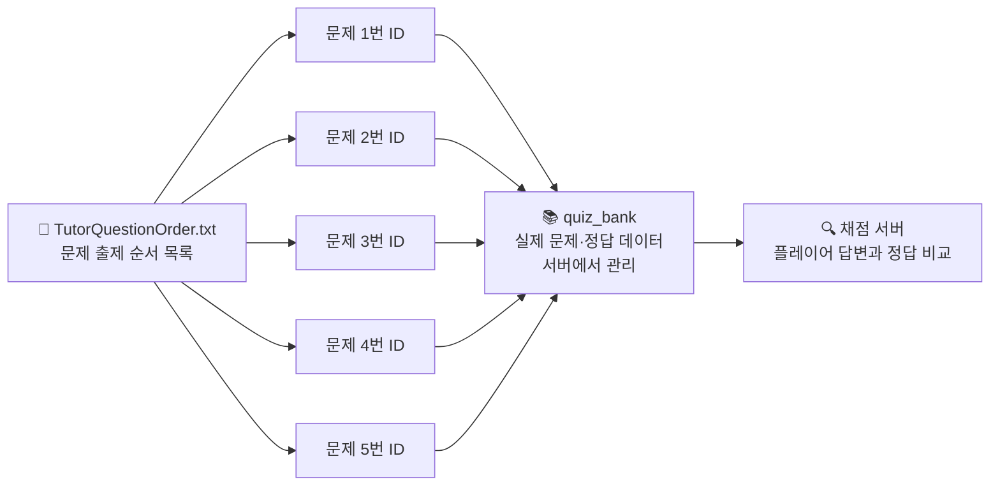

# 체셔의 문제 출제 로직

체셔는 미리 정해진 문제 은행에서 순서대로 퀴즈를 출제합니다.
플레이어가 맞히면 다음 문제로, 틀리면 힌트를 주고 다시 도전하게 합니다.
5문제를 모두 맞히면 퀴즈가 끝납니다.

---

## 문제 출제 전체 흐름

---

## 문제 은행 구조

> 문제 순서는 `TutorQuestionOrder.txt` 파일에서 위에서부터 순서대로 읽습니다.
> 정답을 맞힐 때마다 다음 줄로 넘어가고, 건너뛰면 한 칸 밀립니다.

---

## 퀴즈 진행 상태 요약

| 상태 | 의미 | 다음 행동 |
|------|------|----------|
| **답변 대기 중** | 체셔가 질문을 했고 플레이어 입력을 기다림 | 플레이어가 답 입력 |
| **채점 중** | 서버에 답을 보내고 결과를 기다리는 중 | 자동 진행 |
| **정답 후 다음 대기** | 정답 처리 완료, 다음 문제로 넘길 준비 | 체셔 대사 후 자동 출제 |
| **오답 후 재도전 대기** | 틀렸고 힌트를 받은 상태 | 플레이어가 다시 입력하거나 건너뜀 |
| **완료** | 5문제 모두 정답 | 퀴즈 종료, 입력 잠금 |

---

## 건너뛰기 규칙

- 건너뛰기는 **오답을 받은 직후에만** 가능합니다.
- 건너뛰어도 **정답 수는 올라가지 않습니다.**
- 건너뛴 문제 이후로 순서가 한 칸 밀려 다음 문제가 출제됩니다.
- 5문제를 모두 맞혀야 퀴즈가 끝나므로, 건너뛰기를 반복하면 마지막 문제가 계속 반복될 수 있습니다.
